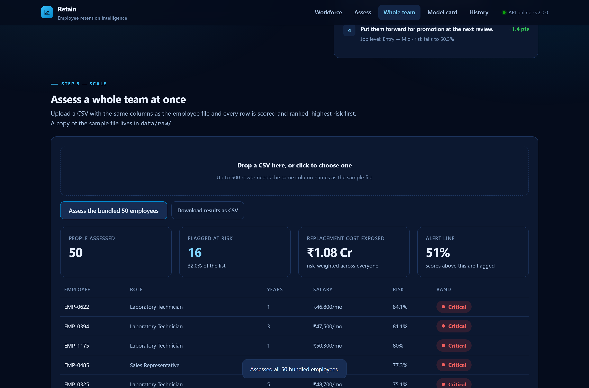
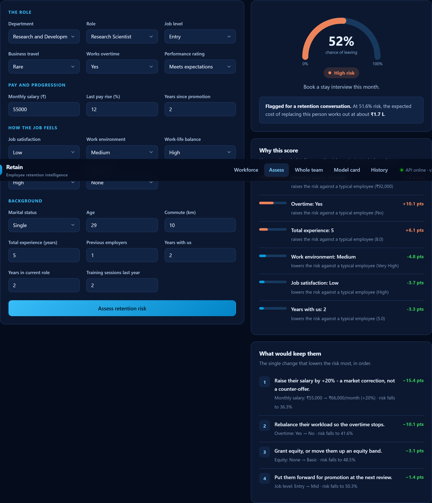

<div align="center">

# Retain

### Employee retention intelligence — know who is about to resign, while you can still act.

A complete, working data science application. It studies the people who have already left,
learns what their situations had in common, and turns that into a plain-English answer for
anyone on your team: **how likely they are to resign, what is driving it, and what would
keep them.**

`Python` · `scikit-learn` · `FastAPI` · `pandas` · `SQLite` · `Vanilla JS`



</div>

---

## Table of contents

1. [What problem does this solve?](#1-what-problem-does-this-solve)
2. [How to open it — two clicks](#2-how-to-open-it--two-clicks)
3. [What you can do with it](#3-what-you-can-do-with-it)
4. [What the data actually says](#4-what-the-data-actually-says)
5. [How it works, step by step](#5-how-it-works-step-by-step)
6. [Every concept explained in plain English](#6-every-concept-explained-in-plain-english)
7. [Fairness — what this tool deliberately will not do](#7-fairness--what-this-tool-deliberately-will-not-do)
8. [The technology, and why each piece is here](#8-the-technology-and-why-each-piece-is-here)
9. [Why there is no MongoDB and no Docker](#9-why-there-is-no-mongodb-and-no-docker)
10. [Project structure](#10-project-structure)
11. [Running it from the command line](#11-running-it-from-the-command-line)
12. [Tests](#12-tests)
13. [Honest limitations](#13-honest-limitations)

---

## 1. What problem does this solve?

When somebody good resigns, it rarely comes as a surprise in hindsight. The signs were
there — the overtime that never let up, the promotion that kept slipping, the salary that
quietly fell behind the market. They just were not written down anywhere, and nobody joined
them up.

Losing an employee is expensive in a way that is easy to underestimate. Once you count
recruitment fees, the notice period, onboarding, and the months before a replacement is
fully productive, the standard estimate is **six months of that person's salary**. For a
team of fifty, losing eighteen people costs more than most retention budgets ever get near.

The catch is that **by the time somebody hands in their notice, the decision is made.**
Counter-offers mostly fail; the person has already mentally left. The useful moment was
months earlier, and nothing about it looked dramatic at the time.

Retain finds that earlier moment. It answers three questions, in order:

| Question | Where it is answered |
|---|---|
| **Who is likely to resign?** | A percentage risk score for anyone you describe |
| **Why are they likely to resign?** | The specific details pushing their score up or down |
| **What should we do about it?** | The single change to their situation that lowers the risk most |

That third one is the part most attrition projects skip, and it is the part an HR team
actually needs on a Monday morning.

---

## 2. How to open it — two clicks

A shortcut named **`Retain Dashboard`** sits on the Desktop.

> **Double-click it. That is the whole process.**

A black command window appears (leave it open — it is the engine running) and your browser
opens the dashboard automatically.

**Do not have the shortcut?** Run this once, from the project folder:

```bash
python main.py shortcut
```

That creates it for you — a proper Windows shortcut with the app icon, or a launcher script
on macOS and Linux. The shortcut itself is never committed to the repository, because it
stores an absolute path that is only valid on the machine that made it; the script that
generates one is committed instead.

**What happens the very first time**

The first launch does two extra jobs, then never does them again:

1. Downloads the free software libraries the project needs (a couple of minutes, once).
2. Reads the employee file, runs the analysis, and trains the model (about half a minute).

Every launch after that opens in a few seconds.

**When you are finished**, close the black window, or click it and press `Ctrl + C`.

**If nothing happens**, Python is probably not installed. Get it free from
[python.org/downloads](https://www.python.org/downloads/) and tick *"Add Python to PATH"*
during setup.

---

## 3. What you can do with it

Five sections, in the order you would actually use them.

### Step 1 — Understand

Charts showing what separates the people who stayed from the ones who left: overtime, job
level, years of service, equity, travel, satisfaction.

Every chart can be hovered for exact figures, and every chart has a **Show data table**
button underneath — so no number is ever locked behind a hover effect.

### Step 2 — Assess



Describe someone and press **Assess retention risk**. You get back:

- **A risk score** — a percentage, on a dial, with a plain-language band
  (Low / Moderate / High / Critical) and what to do about it.
- **Why this score** — the details pushing the number up or down, compared against a
  typical employee, measured in percentage points.
- **What would keep them** — a ranked list of concrete interventions, each showing how far
  it would drop the risk. For example: *"Rebalance their workload so the overtime stops —
  risk falls to 41.6%."* Salary appears here too, tested as a real 10% and 20% rise.

You can also pick any of the 50 real employees from the dropdown to load their details, and
the dashboard will tell you what actually happened to them.

### Step 3 — Scale

Drop in a spreadsheet (CSV) of your team and everyone is scored at once, ranked highest
risk first, with the total replacement cost at stake. Results download as a CSV.

### Step 4 — Trust

An honest scorecard: how often the model is right, how often it is wrong, and — importantly
— *which kind* of wrong. Includes the three models that were compared and why the winner won.

### Step 5 — Track

Every assessment is saved locally, so you can look back at what was scored and when.

---

## 4. What the data actually says

Real patterns in the bundled sample, each one also true of the full 1,470-employee dataset
it was drawn from.

**Overtime is the clearest warning sign there is.**
56% of people regularly working overtime left, against 25% of those who did not. Sustained
extra hours are not a sign of commitment — they are the sound of somebody burning out. This
is also the single feature the model leans on most.

**The first two years decide the next ten.**
50% of employees with under two years' service left, falling to 10% past ten years. Get
somebody through their second year and they tend to stay for good.

**Junior staff walk, senior staff stay.**
50% of entry-level employees left, against 29% at junior level. Early-career people have
the most options and the least tying them to any one employer.

**The people leaving are the ones paid least.**
Leavers earned ₹76,278 a month on average; those who stayed earned ₹1,25,669 — a gap of
₹49,391 every month. Pay is rarely the whole story, but it is never absent from it.

**A stake in the company keeps people in it.**
46% of employees with no equity left, against 26% of those holding even a basic grant.
Something that vests over time gives an obvious reason to still be here when it does.

**Frequent travellers wear out.**
50% of frequent travellers left, against 0% of those who never travel. Travel is a cost
paid in evenings and weekends, and it appears on no budget line.

**What it costs.** The 18 people who left were earning **₹13,73,000 a month** between them.
At six months' salary to replace somebody, that is roughly **₹82,38,000** to rebuild the
same team you already had.

---

## 5. How it works, step by step

```
   data/raw/employee_attrition.csv
              │
              ▼
   ┌──────────────────────┐
   │  1. CLEAN            │   fix broken values, standardise text
   │     retain/data.py   │
   └──────────┬───────────┘
              ▼
   ┌──────────────────────┐
   │  2. ENRICH           │   build new, more revealing columns
   │  retain/features.py  │
   └──────────┬───────────┘
              ▼
        ┌─────┴─────┐
        ▼           ▼
   ┌─────────┐  ┌──────────────┐
   │ 3. LEARN│  │ 4. ANALYSE   │   models/       reports/
   │ train.py│  │ insights.py  │   metrics.json  insights.json
   └────┬────┘  └──────┬───────┘
        └───────┬──────┘
                ▼
   ┌──────────────────────┐
   │  5. SERVE            │   FastAPI: /api/predict, /api/insights, …
   │     retain/api.py    │
   └──────────┬───────────┘
              ▼
   ┌──────────────────────┐
   │  6. DASHBOARD        │   charts, form, explanations
   │     retain/web/      │
   └──────────────────────┘
```

**Step 1 — Clean.** Trims whitespace, forces numeric columns to be numbers, drops duplicate
employee IDs, and removes the employee ID and gender before anything reaches the model.

There is one trap worth naming, because it is invisible and it cost this project a bug.
Pandas treats the literal text `None` as a *missing value*. Two columns here use `None` as
a real category — no equity grant, and no business travel — so read naively, a quarter of
the workforce silently vanished from those charts. The fix is one argument; finding it
took a test that insisted every breakdown add up to fifty people.

**Step 2 — Enrich.** The model gets four columns that did not exist in the file, because
each captures something the raw numbers hide:

| New column | What it means | Why it helps |
|---|---|---|
| `CareerShare` | Years here ÷ total years worked | A 30-year veteran with 28 years here is a very different person from one who joined last year |
| `PromotionGap` | Years since promotion, relative to time here | Three years without a move means little in year twenty and a great deal in year four |
| `PayPerLevel` | Monthly pay ÷ job grade | Catches somebody underpaid *for their grade*, which absolute salary hides |
| `TenureBand` | Service grouped into bands | Lets the model learn "new joiner" as a concept, not just a number |

**Step 3 — Learn.** Three prediction methods compete on the same data. The best wins on
merit, and the runners-up are still shown on the dashboard.

**Step 4 — Analyse.** Every chart is calculated once and saved, rather than recalculated
each time somebody opens a page.

**Step 5 — Serve.** A small web service loads the trained model and answers questions over
HTTP.

**Step 6 — Dashboard.** The page you actually see.

---

## 6. Every concept explained in plain English

<details open>
<summary><b>Attrition</b></summary>

Employees leaving. "Attrition rate" is the share who leave in a given period. In this
sample it is 36% — deliberately higher than reality, for reasons explained in
[limitations](#13-honest-limitations).
</details>

<details open>
<summary><b>Machine learning — what is actually happening</b></summary>

There is no magic and no "AI understanding". The computer does something much simpler than
it sounds: it looks at thousands of combinations of employee details and outcomes, and
finds the combinations that reliably came *before* somebody left.

A useful analogy: an experienced manager who, after twenty years, can tell when a good
person is about to hand in their notice. They could not write down the rule, but they have
seen the pattern often enough to recognise it. That is what the model does — except it can
hold far more patterns in mind at once, and it can show its working.
</details>

<details open>
<summary><b>Training and testing — why you must never mark your own homework</b></summary>

Show a model some employees and then test it on those *same* employees, and it will look
brilliant and be useless. It has memorised the answers rather than learned the pattern.

So the data is always split: the model learns from one group and is scored on a group it
has never seen. Only the second number means anything.
</details>

<details open>
<summary><b>Cross-validation — the trick this project uses</b></summary>

With only 50 employees, holding back a test group would leave about ten people. Getting
seven right instead of six would swing the score by ten points. That is not a measurement,
it is a coin flip.

**Cross-validation** solves this. Split the 50 into 5 groups. Train on 4, test on the 5th.
Repeat so each group takes a turn. Now every single employee has been predicted by a model
that never saw them.

This project repeats that whole exercise 10 times with different random shuffles — **50
models trained in total** — and averages the results. It is the most honest measurement
available from a small sample.
</details>

<details open>
<summary><b>ROC-AUC — the "ranking quality" score</b></summary>

The headline score, and the one used to pick the winning model.

Pick one employee who left and one who stayed, at random. **ROC-AUC is the probability that
the model gave the leaver the higher risk score.**

- `1.0` = perfect, always ranks them correctly
- `0.5` = useless, no better than a coin flip

This model scores **0.688** — it gets that comparison right about 69% of the time. Better
than guessing, and modest, which is exactly what an honest 50-person sample should produce.
</details>

<details open>
<summary><b>Precision and recall — the two ways to be wrong</b></summary>

Say the model flags 15 people as at risk.

- **Recall** answers *"of everyone really about to leave, how many did we catch?"*
  Here: **56%**. Miss somebody and you lose them entirely.
- **Precision** answers *"of everyone we flagged, how many really were leaving?"*
  Here: **67%**. A wrong flag costs one unnecessary conversation.

These pull against each other. Flag everybody and recall is perfect but precision is
terrible. The right balance depends on what each mistake costs — and here, **missing a
leaver costs vastly more than an awkward chat**.
</details>

<details open>
<summary><b>The decision threshold — and why it is not 50%</b></summary>

The model outputs a percentage. Something has to decide where "flag this person" begins.

The obvious choice is 50%, and it is the wrong one. It treats both mistakes as equally bad,
when one costs a conversation and the other costs a person and six months of their salary.

This project sets the line at **51%**, chosen automatically to get the best balance of
precision and recall on data the model had not seen. Lowering it catches more leavers at
the cost of more false alarms — a business decision, deliberately made visible rather than
buried in code.
</details>

<details open>
<summary><b>The confusion matrix</b></summary>

Every employee falls into exactly one of four boxes:

|  | Predicted to stay | Predicted to leave |
|---|---|---|
| **Actually stayed** | 27 — correctly left alone | 5 — false alarm |
| **Actually left** | 8 — **missed leaver** | 10 — correctly caught |

The two red boxes are the mistakes, and they are not equally bad. The 5 false alarms cost 5
unnecessary conversations. The 8 missed leavers cost 8 whole people.
</details>

<details open>
<summary><b>Feature importance — what the model pays attention to</b></summary>

Measured by **permutation importance**: take one column, shuffle its values randomly to
destroy the information in it, and see how much worse the model gets. A big drop means the
model was leaning on that column heavily.

Here the top signal is **overtime**, followed by training, work environment and travel. The
method works on any model, however complicated, without needing to see inside it.
</details>

<details open>
<summary><b>How the "why" and "what to do" explanations work</b></summary>

Rather than trying to read the model's internal wiring, this project **asks it "what if?"**
— the same way you would interrogate a colleague.

- **Why this score:** take the employee, change one detail to what a typical employee has,
  and re-score. If the risk drops 10 points, that detail was worth 10 points.
- **What would keep them:** try every alternative for every changeable detail, and keep the
  single change that lowers the risk most. Salary gets its own treatment, tested as a real
  10% and 20% rise.

Three deliberate design decisions here. First, all the "what if" versions are scored in one
batch, so a full explanation costs about as much as a single prediction. Second,
recommendations never touch gender, age, marital status or department — see
[fairness](#7-fairness--what-this-tool-deliberately-will-not-do). Third, and least obvious:
**a recommendation may only ever propose an improvement.** On a small sample the model will
sometimes report that *lowering* somebody's involvement reduces their risk. Left unchecked,
the tool would pair the advice "give them ownership of something visible" with a downgrade
from High to Medium — advice contradicting the change it was based on. Each of these scales
now has a defined direction, and only moves up it are ever proposed.
</details>

<details open>
<summary><b>One-hot encoding and scaling</b></summary>

Models do arithmetic, so words must become numbers first.

**One-hot encoding** turns `JobLevel` into five yes/no columns: *is it Entry?*, *is it
Junior?*, and so on. This matters — number them 1 to 5 instead and the model wrongly
concludes an Executive is "five times" an Entry-level employee.

**Scaling** puts number columns on a comparable footing. Age runs 18–60; monthly salary
runs 31,000–397,000. Without scaling, some models assume the bigger numbers matter more
purely because they are bigger.
</details>

<details open>
<summary><b>The three models compared</b></summary>

| Model | How it thinks | Result |
|---|---|---|
| **Logistic Regression** | Gives every detail a weight and adds them up. Simple and completely readable. | 0.649 |
| **Random Forest** | Builds 300 small decision trees on different slices of the data and takes a vote. | **0.688 — winner** |
| **Gradient Boosting** | Builds trees one after another, each correcting the last one's mistakes. | 0.611 |

All three are deliberately kept small — shallow trees, strong regularisation — because with
50 rows a powerful model memorises the data instead of learning from it.
</details>

<details open>
<summary><b>Overfitting</b></summary>

The central failure of machine learning: memorising the examples instead of learning the
rule. An overfitted model scores brilliantly on data it has seen and falls apart on anything
new — like a student who memorised past exam papers and is lost when the questions change.

Everything in this project's setup — cross-validation, shallow trees, regularisation —
exists to prevent it.
</details>

---

## 7. Fairness — what this tool deliberately will not do

This is software that influences decisions about people's careers, so some restraint is
built into it rather than left to the user's judgement.

**Gender is never used to predict.** It is dropped in `retain/data.py` before the data
reaches the model, it is absent from the API's input schema, and a test asserts it cannot
appear as a feature. Training on it would let the model learn "women in this team leave more
often" and then quietly price retention offers by sex — unlawful in most jurisdictions and
indefensible in all of them.

**Gender is still reported, in its own panel.** Monitoring whether attrition falls unevenly
across a workforce is a legitimate and important HR job. It is simply a different job from
predicting with it, and only the first belongs here. The dashboard shows the breakdown and
says exactly why it sits apart.

**Recommendations never target who somebody is.** Age, marital status, gender, department
and role are all excluded from the "what would keep them" list. A retention plan may propose
changing someone's workload, pay, equity, travel or progression — things the business
controls — and nothing else. There is a test for this.

**Every recommendation must be an improvement.** Described above: the tool cannot suggest
making somebody's job worse, even if the model believes it would lower their risk score.

---

## 8. The technology, and why each piece is here

### Language

**Python 3.10+** — the standard language for data science, because the libraries below all
live here. The project is *pure Python*; there is no notebook, only proper testable modules
that a real application can import.

### Working with data

| Tool | What it does |
|---|---|
| **pandas** | The spreadsheet of the programming world — loads the CSV, cleans columns, groups and counts |
| **NumPy** | Fast maths on whole columns at once, underneath pandas |

### Machine learning

| Tool | What it does |
|---|---|
| **scikit-learn** | The models, the train/test machinery, the scoring, the encoding. The most widely used ML library in the world. |
| **joblib** | Saves the trained model to a file so it does not relearn on every launch |

Key scikit-learn pieces: `Pipeline` (glues cleaning to the model so they cannot fall out of
step), `ColumnTransformer` (different treatment for text and number columns),
`RepeatedStratifiedKFold` (the cross-validation above), and `permutation_importance`.

### The web service

| Tool | What it does |
|---|---|
| **FastAPI** | Turns Python functions into a web service; generates live API docs for free at `/docs` |
| **Uvicorn** | The engine that serves the pages |
| **Pydantic** | Validates incoming data before it reaches the model — an invalid job level is rejected with a clear message rather than producing a nonsense prediction |

### Storage

| Tool | What it does |
|---|---|
| **SQLite** | Saves every assessment. Built into Python — no server, no service, the whole database is one file. |

### The dashboard

| Tool | What it does |
|---|---|
| **HTML / CSS / JavaScript** | Written by hand, no framework |
| **Custom SVG charts** | Every chart drawn by ~400 lines of project code |

**Why no React, and no chart library?** Because neither was needed, and both cost something
real. There is no build step, no `node_modules`, and no external service — the dashboard
works with no internet connection at all. The charts were written by hand specifically so
their colours could be checked for colour-blind readability against the dark navy
background, which an off-the-shelf library would not have allowed.

### Design

Deep navy and sky blue throughout. The colours used for the *data* were not chosen by eye —
they were run through a contrast and colour-blindness validator against the exact background
they sit on:

- Every text colour clears WCAG AA (the weakest is 5.8:1 against a required 4.5:1).
- The two data colours stay distinguishable under both red-green colour-blindness simulations.
- No chart relies on colour alone — each has a legend, a hover tooltip and a data table.

Money is formatted in **Indian digit grouping** — ₹82,38,000, not ₹8,238,000 — and stat
tiles use lakh and crore, because that is how the numbers will actually be read.

---

## 9. Why there is no MongoDB and no Docker

Both were considered and deliberately left out. A tool that does not earn its place is a
cost, not a feature.

**MongoDB** is a database server, excellent when data is large, unpredictably shaped, or
spread across machines. This project's data is a 50-row spreadsheet with fixed columns plus
a log of assessments. **SQLite** — already inside Python, needing no installation and no
running service — does the same job with zero setup. Adding MongoDB would mean installing
and running a database server for no gain.

**Docker** packages an application with its operating system so it runs identically
anywhere. Genuinely valuable when deploying to a server; a poor trade for somebody who wants
to double-click an icon on their own computer, since they would first have to install Docker
Desktop, learn what a container is, and use a terminal. `requirements.txt` plus a launcher
achieves the same result in one double-click.

If this were deployed to a cloud server for a real HR team, Docker would earn its place
immediately. For a dashboard that runs locally, it does not.

---

## 10. Project structure

```
Retain/
│
├── Launch Dashboard.bat          ← the desktop shortcut points here
├── main.py                       ← command line entry point
│
├── retain/                       ← the application
│   ├── config.py                 ← paths, columns, risk bands, cost assumptions
│   ├── data.py                   ← loading and cleaning
│   ├── features.py               ← the four engineered columns + preprocessing
│   ├── train.py                  ← model comparison, threshold tuning, evaluation
│   ├── insights.py               ← the dashboard's statistics and headlines
│   ├── predictor.py              ← scoring + the "why" and "what would keep them" logic
│   ├── storage.py                ← SQLite assessment log
│   ├── console.py                ← UTF-8 terminal, so the rupee sign prints on Windows
│   ├── api.py                    ← the web service
│   └── web/                      ← the dashboard (HTML, CSS, JS)
│
├── scripts/make_shortcut.py      ← creates the desktop shortcut
├── assets/make_icon.py           ← generates the app icon
├── data/raw/                     ← the 50-employee dataset
├── models/  reports/             ← trained model, scorecard, computed analysis
├── tests/                        ← 77 automated tests
└── docs/                         ← earlier exploratory work, kept for reference
```

---

## 11. Running it from the command line

```bash
pip install -r requirements.txt

python main.py build      # analyse the data and train the model
python main.py serve      # start the dashboard (opens your browser)
python main.py shortcut   # create the desktop shortcut

python main.py analyse    # just the workforce analysis
python main.py train      # just the model training
python main.py predict --salary 45000 --years 2 --overtime Yes
```

`serve` accepts `--port`, `--host`, `--reload` and `--no-browser`. It rebuilds the model
automatically if it is missing, or if the data file has been edited since it was last
trained.

### The API

Interactive documentation is generated automatically at `http://127.0.0.1:8000/docs`.

| Method | Endpoint | Purpose |
|---|---|---|
| `GET` | `/api/health` | Is the service up, is a model loaded |
| `GET` | `/api/insights` | Every statistic behind the dashboard |
| `GET` | `/api/model` | Scorecard, leaderboard, feature importance |
| `GET` | `/api/schema` | The valid values for every field |
| `POST` | `/api/predict` | Score one employee, with explanations |
| `POST` | `/api/predict/batch` | Score a list of employees |
| `POST` | `/api/predict/csv` | Score an uploaded CSV file |
| `GET` | `/api/history` | Recent assessments |
| `DELETE` | `/api/history` | Clear the assessment log |

---

## 12. Tests

```bash
python -m pytest
```

**77 tests, all passing.** They are not decoration — they check things that would otherwise
break silently:

- Cleaning genuinely fixes the broken columns, and never alters the input data.
- **`None` survives as a real category** — the pandas trap described earlier.
- A brand-new employee (0 years anywhere) does not cause a divide-by-zero.
- Every breakdown on the dashboard adds up to the full headcount.
- **The headline claims are actually true of the data** — if a future dataset made
  "overtime workers leave more" false, the test suite fails rather than the dashboard
  quietly lying.
- Every recommended action, when applied, really does produce a lower risk score.
- **No recommendation is ever a downgrade**, and none targets gender, age, marital status,
  department or role.
- Gender cannot reach the model, the schema, or the risk-group list.
- Money formats with Indian digit grouping.
- Invalid input is rejected with a clear error rather than a nonsense prediction.

Four real bugs were caught this way during development: a histogram silently dropping the
longest-serving employees, two reported scores disagreeing because of rounding, the pandas
`None` collapse, and the recommendation that argued for making somebody's job worse.

---

## 13. Honest limitations

**This ships with 50 employees, and that is a small number.** The source dataset (IBM HR
Analytics Employee Attrition, a public dataset widely used for teaching) has 1,470. This one
was deliberately cut down to keep the project light and readable.

**Leavers are over-represented on purpose.** The real attrition rate in the source data is
16%, which across 50 people would give only 8 leavers — far too few to learn anything from.
The sample is enriched to 18 leavers in 50 (36%) so the model has something to work with,
while the split *within* each outcome still follows the real overtime mix, keeping the
drivers' true shape. **The 36% headline is a property of this sample, not of the source
organisation.**

The consequence is stated on the dashboard and repeated here: **the accuracy figures
demonstrate that the method works end to end — they are not production benchmarks.**
Published results on the full dataset typically reach around 0.85 ROC-AUC against the 0.688
measured here. To run it on the full data, drop the complete CSV into
`data/raw/employee_attrition.csv` and run `python main.py build`; the pipeline adapts.

**Salaries have been rescaled.** The source records pay on a US scale. Every figure is
multiplied by 20 to land on a realistic Indian monthly range (about ₹31,000 to ₹3,97,000).
Multiplying every row by the same constant cannot change who the model ranks as at risk —
it only makes the rupee figures mean something.

Two further caveats:

- **Some small groups are noisy.** With only 3 senior-level employees in the sample, that
  group's rate is not reliable. Group sizes appear in every tooltip and data table so you
  can judge for yourself.
- **These are correlations, not causes.** People with equity leave less, but handing
  somebody shares will not by itself make them loyal — the equity partly *marked out* people
  the company had already invested in. Read the recommendations as "people in this situation
  tend to stay", not as guaranteed levers. A conversation is always better evidence than a
  model.

---

<div align="center">

**Dataset** · IBM HR Analytics Employee Attrition (public, widely used for teaching)
**Licence** · MIT

</div>
