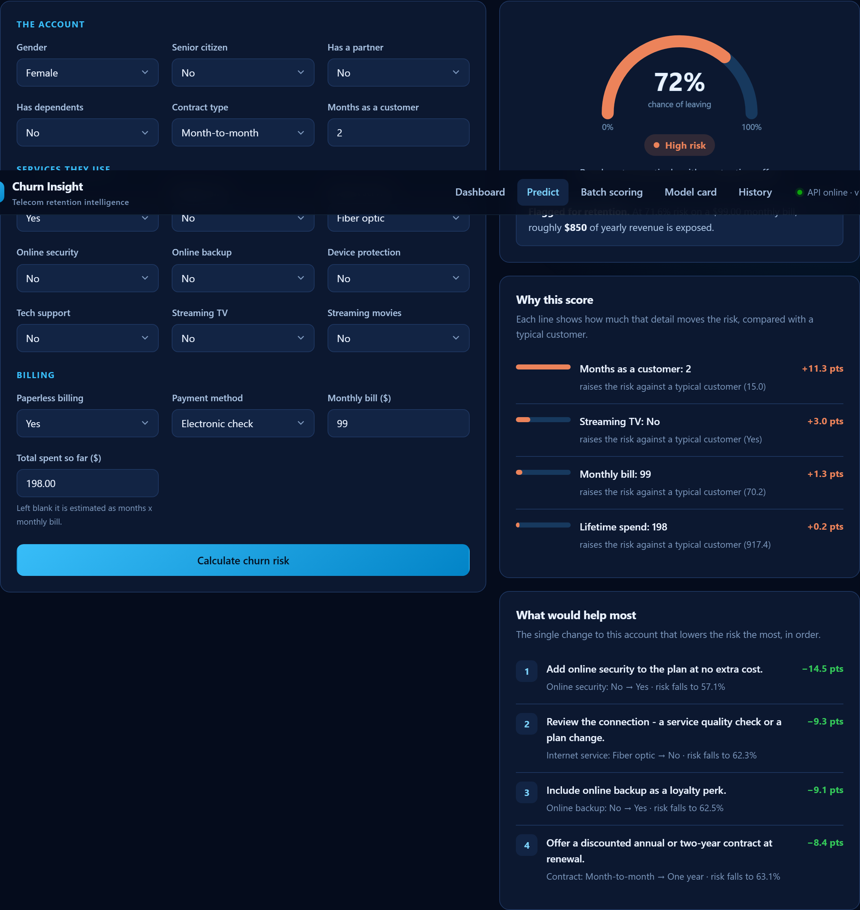

<div align="center">

# Churn Insight

### Know which telecom customers are about to leave — before they do.

A complete, working data science application: it studies real customer records, learns
what leaving looks like, and turns that into a plain-English answer for any customer you
describe — **how likely they are to go, why, and what to offer them instead.**

`Python` · `scikit-learn` · `FastAPI` · `pandas` · `SQLite` · `Vanilla JS`


</div>

---

## Table of contents

1. [What problem does this solve?](#1-what-problem-does-this-solve)
2. [How to open it — two clicks](#2-how-to-open-it--two-clicks)
3. [What you can do with it](#3-what-you-can-do-with-it)
4. [What the data actually says](#4-what-the-data-actually-says)
5. [How it works, step by step](#5-how-it-works-step-by-step)
6. [Every concept explained in plain English](#6-every-concept-explained-in-plain-english)
7. [The technology, and why each piece is here](#7-the-technology-and-why-each-piece-is-here)
8. [Why there is no MongoDB and no Docker](#8-why-there-is-no-mongodb-and-no-docker)
9. [Project structure](#9-project-structure)
10. [Running it from the command line](#10-running-it-from-the-command-line)
11. [Tests](#11-tests)
12. [Honest limitations](#12-honest-limitations)

---

## 1. What problem does this solve?

Imagine you run a phone and internet company. Every month, a slice of your customers quietly
cancel and move to a competitor. This is called **churn**.

Churn is expensive in a way that is easy to underestimate. Winning a brand-new customer
costs far more than keeping one you already have — you pay for advertising, sales staff,
sign-up discounts and new equipment. Keeping an existing customer often costs one phone
call and a small offer.

The catch is that **by the time someone rings up to cancel, the decision is already made.**
The useful moment was weeks earlier, and nothing about that moment looked dramatic.

This project finds that earlier moment. It looks at customers who left in the past, works
out what they had in common, and uses those patterns to flag people who look the same way
*today* — while there is still time to do something.

It answers three questions, in order:

| Question | Where it is answered |
|---|---|
| **Who is likely to leave?** | A percentage risk score for any customer |
| **Why are they likely to leave?** | The specific details pushing their score up or down |
| **What should we do about it?** | The single change to their account that lowers the risk most |

That third one is the part most churn projects skip, and it is the part a retention team
actually needs.

---

## 2. How to open it — two clicks

A shortcut named **`Churn Insight Dashboard`** has been placed on the Desktop.

> **Double-click it. That is the whole process.**

A black command window appears (leave it open — it is the engine running) and your web
browser opens the dashboard automatically.

**What happens the very first time**

The first launch does two extra jobs, then never does them again:

1. Downloads the free software libraries the project needs (a couple of minutes, one time).
2. Reads the customer file, runs the analysis, and trains the prediction model
   (about half a minute).

Every launch after that opens in a few seconds.

**When you are finished**, close the black window, or click it and press `Ctrl + C`.

**If nothing happens**, Python is probably not installed. Get it free from
[python.org/downloads](https://www.python.org/downloads/) and tick the box that says
*"Add Python to PATH"* during setup. Then double-click the shortcut again.

---

## 3. What you can do with it

The dashboard is one page with five sections, arranged in the order you would actually
use them.

### Step 1 — Understand

Charts showing what separates the customers who stayed from the ones who left: contract
type, how long they had been a customer, how they paid, which services they used.

Every chart can be hovered for exact figures, and every chart has a **Show data table**
button underneath — so no number is ever locked behind a hover effect.

### Step 2 — Predict



Describe a customer using the form and press **Calculate churn risk**. You get back:

- **A risk score** — a percentage, on a dial, with a plain-language band
  (Low / Moderate / High / Critical).
- **Why this score** — the details that pushed the number up or down, compared against a
  typical customer, measured in percentage points.
- **What would help most** — a ranked list of concrete offers, each one showing how far it
  would drop the risk. For example: *"Add online security to the plan at no extra cost —
  risk falls to 44.0%."*

You can also pick any of the 50 real customers from the dropdown to load their actual
details, and the dashboard will tell you what really happened to them.

### Step 3 — Scale

Drop in a spreadsheet (CSV) of customers and every row is scored at once, ranked riskiest
first, with the total revenue at stake. Results download as a CSV.

### Step 4 — Trust

An honest scorecard for the model: how often it is right, how often it is wrong, and —
importantly — *which kind* of wrong. Includes the three models that were compared and why
the winner won.

### Step 5 — Track

Every prediction is saved locally, so you can look back at what was scored and when.

---

## 4. What the data actually says

These are the real patterns in the bundled sample. They match what the full 7,043-customer
version of this dataset shows, which is a good sign that the sample is representative.

**Rolling monthly contracts are the biggest single leak.**
48% of month-to-month customers left, against 14% of those on a two-year deal. Nothing is
holding the monthly customer in place, so every bill is an opportunity to reconsider.

**The first six months decide everything.**
50% of customers churned inside their first six months, falling to 20% once they passed
four years. Attention paid early is worth far more than a discount offered late.

**The premium product loses the most customers.**
Fibre optic users left at 48% versus 26% on slower DSL — despite fibre costing more.
People paying a premium expect a premium experience and judge it harshly. This is a
service-quality problem wearing a pricing costume.

**How someone pays reveals how committed they are.**
Electronic-cheque payers churned at 50%; customers on automatic credit card payment, 17%.
Somebody who has set up autopay has quietly decided to stay. The payment method is not
*causing* loyalty — it is *revealing* it.

**Bundled customers are harder to lose.**
Customers who stayed used 4.5 services on average; those who left used 4.1. Each extra
service is one more thing to unpick before switching provider — and support services
(tech support, online security) hold on tighter than entertainment ones.

**What it is worth.** The 16 customers who left were paying **$1,174 a month** — about
**$14,092 a year** walking out of the door. Keeping even a third of them pays for the
entire retention effort.

---

## 5. How it works, step by step

```
   data/raw/customer_churn.csv
              │
              ▼
   ┌──────────────────────┐
   │  1. CLEAN            │   fix broken values, standardise text
   │     churn/data.py    │
   └──────────┬───────────┘
              ▼
   ┌──────────────────────┐
   │  2. ENRICH           │   build new, more useful columns
   │     churn/features.py│
   └──────────┬───────────┘
              ▼
        ┌─────┴─────┐
        ▼           ▼
   ┌─────────┐  ┌──────────────┐
   │ 3. LEARN│  │ 4. ANALYSE   │   models/       reports/
   │ train.py│  │ insights.py  │   metrics.json  insights.json
   └────┬────┘  └──────┬───────┘
        └───────┬──────┘
                ▼
   ┌──────────────────────┐
   │  5. SERVE            │   FastAPI: /api/predict, /api/insights, …
   │     churn/api.py     │
   └──────────┬───────────┘
              ▼
   ┌──────────────────────┐
   │  6. DASHBOARD        │   charts, form, explanations
   │     churn/web/       │
   └──────────────────────┘
```

**Step 1 — Clean.** Raw data is never tidy. Here, the "total amount paid" column was stored
as *text* rather than a number, and was blank for brand-new customers. Those blanks are
filled with `0` — not a guess, but the literal truth: someone who joined this month has
genuinely paid nothing yet. The "senior citizen" column stored `0` and `1`; those become
`No` and `Yes` so a human reading the data understands it instantly.

**Step 2 — Enrich.** The model is given four columns that did not exist in the original
file, because they capture something the raw numbers hide:

| New column | What it means | Why it helps |
|---|---|---|
| `NumServices` | How many of the nine add-ons they actually use | Bundled customers are harder to lose |
| `AvgMonthlySpend` | Total paid ÷ months as a customer | What they have *historically* paid per month |
| `ChargeRatio` | This month's bill ÷ that historical average | Well above 1 means a recent price rise — a classic trigger |
| `TenureBand` | Tenure grouped into `0-6 months`, `6-12 months`, … | Lets the model learn "new customer" as a concept, not just a number |

`ChargeRatio` is the interesting one. A £90 bill means nothing on its own. A £90 bill for
somebody who has been paying £60 for three years means a lot.

**Step 3 — Learn.** Three different prediction methods compete on the same data. The best
one wins on merit, and the runners-up are still shown on the dashboard.

**Step 4 — Analyse.** All the dashboard's charts are calculated once and saved, rather than
recalculated every time somebody opens a page.

**Step 5 — Serve.** A small web service loads the trained model and answers questions over
the internet's standard language (HTTP).

**Step 6 — Dashboard.** The web page you actually see.

---

## 6. Every concept explained in plain English

<details open>
<summary><b>Churn</b></summary>

A customer cancelling their service. "Churn rate" is the share of customers who leave in a
given period. In this sample, 32%.
</details>

<details open>
<summary><b>Machine learning — what is actually happening</b></summary>

There is no magic and no "AI understanding" involved. The computer is doing something much
simpler than it sounds: it looks at thousands of combinations of customer details and
outcomes, and finds the combinations that reliably came *before* someone left.

A useful analogy: an experienced shop manager who, after twenty years, can tell which
browsing customers are about to walk out empty-handed. They could not write down the rule,
but they have seen the pattern enough times to recognise it. That is what the model is
doing — except it can hold far more patterns in mind at once, and it can show its working.
</details>

<details open>
<summary><b>Training and testing — why you must never mark your own homework</b></summary>

If you show a model some customers and then test it on those *same* customers, it will look
brilliant and be useless. It has memorised the answers rather than learned the pattern.

So the data is always split: the model learns from one group and is scored on a group it
has never seen. Only the second number means anything.
</details>

<details open>
<summary><b>Cross-validation — the trick this project uses</b></summary>

With only 50 customers, holding back a test group would leave about ten people. Getting
seven right instead of six would swing the score by ten points. That is not a measurement,
it is a coin flip.

**Cross-validation** solves this. Split the 50 customers into 5 groups. Train on 4 groups,
test on the 5th. Repeat so each group takes a turn being the test. Now every single
customer has been predicted by a model that never saw them.

This project then repeats that whole exercise 10 times with different random shuffles —
**50 models trained in total** — and averages the results. It is the most honest possible
measurement from a small sample.
</details>

<details open>
<summary><b>ROC-AUC — the "ranking quality" score</b></summary>

The headline score, and the one used to pick the winning model.

Pick one customer who left and one who stayed, at random. **ROC-AUC is the probability that
the model gave the leaver the higher risk score.**

- `1.0` = perfect, always ranks them correctly
- `0.5` = useless, no better than flipping a coin

This model scores **0.704** — it gets that comparison right about 70% of the time.
Distinctly better than guessing, and modest, which is exactly what an honest 50-customer
sample should produce.
</details>

<details open>
<summary><b>Precision and recall — the two ways to be wrong</b></summary>

Say the model flags 23 customers as at-risk.

- **Recall** answers *"of everyone who was really going to leave, how many did we catch?"*
  Here: **69%**. Miss someone and you lose the customer entirely.
- **Precision** answers *"of everyone we flagged, how many really were leaving?"*
  Here: **48%**. A wrong flag costs you a needless phone call and a small discount.

These two pull against each other. Flag everybody and recall is perfect but precision is
terrible. Flag nobody and the reverse. The right balance depends on what each mistake
costs you — and for churn, **missing a leaver costs far more than a wasted phone call**.
</details>

<details open>
<summary><b>The decision threshold — and why it is not 50%</b></summary>

The model outputs a percentage. Something has to decide where "flag this customer" begins.

The obvious choice is 50%, and it is the wrong one. Only about a third of these customers
churn, so a 50% cut-off is tuned for a coin-flip world that does not exist here. Worse, it
treats both mistakes as equally bad, when one costs a phone call and the other costs a
customer.

This project sets the line at **44%**, chosen automatically to get the best balance of
precision and recall. Lowering the line catches more leavers at the cost of more false
alarms — a business decision, deliberately made visible rather than buried.
</details>

<details open>
<summary><b>The confusion matrix</b></summary>

Every customer falls into exactly one of four boxes:

|  | Predicted to stay | Predicted to leave |
|---|---|---|
| **Actually stayed** | 22 — correctly left alone | 12 — false alarm |
| **Actually left** | 5 — **missed leaver** | 11 — correctly caught |

The two red boxes are the mistakes, and they are not equally bad. The 12 false alarms cost
12 unnecessary retention calls. The 5 missed leavers cost 5 entire customers.
</details>

<details open>
<summary><b>Feature importance — what the model pays attention to</b></summary>

Measured by **permutation importance**: take one column, shuffle its values randomly to
destroy any real information in it, and see how much worse the model gets. A big drop means
the model was leaning on that column heavily.

The appeal of this method is that it works on any model, however complicated, without
needing to see inside it.
</details>

<details open>
<summary><b>How the "why" and "what to do" explanations work</b></summary>

Rather than trying to read the model's internal wiring, this project simply **asks it
"what if?"** — the same way you would interrogate a colleague.

- **Why this score:** take the customer, change one detail to what a typical customer has,
  and re-score them. If the risk drops 14 points, that detail was worth 14 points.
- **What would help most:** try *every* alternative for every changeable detail, and keep
  the single change that lowers the risk most.

Two deliberate design decisions here. First, all these "what if" versions are scored in one
batch, so a full explanation costs about as much as a single prediction. Second, the
recommendations never suggest changing a customer's **gender, age, or family situation** —
those are neither changeable nor an acceptable basis for a retention offer. Only things the
business can actually act on are considered.
</details>

<details open>
<summary><b>One-hot encoding and scaling</b></summary>

Models do arithmetic, so words have to become numbers first.

**One-hot encoding** turns `Contract` into three yes/no columns: *is it month-to-month?*,
*is it one year?*, *is it two year?*. This matters — if you instead numbered them 1, 2, 3,
the model would wrongly conclude that a two-year contract is "three times" a monthly one.

**Scaling** puts number columns on a comparable footing. Tenure runs 0–72; total charges
run 0–8,000. Without scaling, some models assume the bigger numbers are more important
purely because they are bigger.
</details>

<details open>
<summary><b>The three models compared</b></summary>

| Model | How it thinks | Result |
|---|---|---|
| **Logistic Regression** | Gives every detail a weight, adds them up. Simple and completely readable. | 0.676 |
| **Random Forest** | Builds 300 small decision trees on different slices of the data and takes a vote. | **0.704 — winner** |
| **Gradient Boosting** | Builds trees one after another, each correcting the previous one's mistakes. | 0.662 |

All three are deliberately kept small and simple — shallow trees, strong regularisation —
because with 50 rows, a powerful model memorises the data instead of learning from it.
</details>

<details open>
<summary><b>Overfitting</b></summary>

The central failure of machine learning: memorising the examples instead of learning the
rule. An overfitted model scores brilliantly on data it has seen and falls apart on anything
new — like a student who memorised past exam papers and is lost when the questions change.

Everything in this project's setup — cross-validation, shallow trees, regularisation —
exists to prevent it.
</details>

---

## 7. The technology, and why each piece is here

### Language

**Python 3.10+** — the standard language for data science, because the libraries below all
live here. The project is *pure Python*; the original Jupyter notebook has been replaced by
proper, testable modules that a real application can import.

### Working with data

| Tool | What it does |
|---|---|
| **pandas** | The spreadsheet of the programming world — loads the CSV, cleans columns, groups and counts |
| **NumPy** | Fast maths on whole columns at once, underneath pandas |

### Machine learning

| Tool | What it does |
|---|---|
| **scikit-learn** | The models, the train/test machinery, the scoring, the encoding. The most widely used ML library in the world. |
| **joblib** | Saves the trained model to a file so it does not have to relearn on every launch |

Key scikit-learn pieces used here: `Pipeline` (glues cleaning and model together so they can
never fall out of step), `ColumnTransformer` (different treatment for text vs number
columns), `RepeatedStratifiedKFold` (the cross-validation described above), and
`permutation_importance`.

### The web service

| Tool | What it does |
|---|---|
| **FastAPI** | Turns Python functions into a web service; also generates live API documentation for free at `/docs` |
| **Uvicorn** | The engine that actually serves the pages |
| **Pydantic** | Checks incoming data before it reaches the model — a bad contract type is rejected with a clear message rather than producing a nonsense prediction |

### Storage

| Tool | What it does |
|---|---|
| **SQLite** | Saves every prediction. Built into Python — no server to install, no service to run, the whole database is one file. |

### The dashboard

| Tool | What it does |
|---|---|
| **HTML / CSS / JavaScript** | Written by hand, no framework |
| **Custom SVG charts** | Every chart is drawn by ~400 lines of project code |

**Why no React, and no chart library?** Because none was needed, and both would cost
something real. There is no build step to run, no `node_modules` folder, and no external
service to call — the dashboard works with no internet connection at all. The charts were
written by hand specifically so their colours could be checked for colour-blind readability
against the dark navy background, which an off-the-shelf library would not have allowed.

### Design

The interface is deep navy and sky blue throughout. The colours used for the *data* were not
chosen by eye — they were run through a contrast and colour-blindness validator against the
exact background they sit on. The result:

- Every text colour clears the WCAG AA readability standard (the weakest is 5.8:1 against a
  required 4.5:1).
- The two data colours stay clearly distinguishable under both red-green colour blindness
  simulations.
- No chart relies on colour alone — every one has a legend, a hover tooltip and a data table.

---

## 8. Why there is no MongoDB and no Docker

Both were considered and deliberately left out. Adding a tool that does not earn its place
is a cost, not a feature.

**MongoDB** is a database server, and it excels when data is large, unpredictably shaped, or
spread across many machines. This project's data is a 50-row spreadsheet with fixed columns
and a handful of saved predictions. **SQLite** — already inside Python, needing no
installation and no running service — does the same job here with zero setup. Adding MongoDB
would mean installing and running a database server so the user could gain nothing.

**Docker** packages an application with its operating system so it runs identically
anywhere. That is genuinely valuable when deploying to a server. It is a poor trade for
someone who wants to double-click an icon on their own computer: they would first have to
install Docker Desktop (several gigabytes), learn what a container is, and run commands in a
terminal. `requirements.txt` plus a launcher achieves the same result in one double-click.

If this project were ever deployed to a cloud server for a real team, Docker would earn its
place immediately. For a dashboard that runs locally, it does not.

---

## 9. Project structure

```
Telcom-Customer-Churn-Prediction/
│
├── Launch Dashboard.bat          ← the desktop shortcut points here
├── main.py                       ← command line entry point
│
├── churn/                        ← the application
│   ├── config.py                 ← all paths, columns and settings in one place
│   ├── data.py                   ← loading and cleaning
│   ├── features.py               ← the four engineered columns + preprocessing
│   ├── train.py                  ← model comparison, tuning, evaluation
│   ├── insights.py               ← the dashboard's statistics
│   ├── predictor.py              ← scoring + the "why" and "what to do" explanations
│   ├── storage.py                ← SQLite prediction log
│   ├── api.py                    ← the web service
│   └── web/                      ← the dashboard (HTML, CSS, JS)
│
├── data/raw/customer_churn.csv   ← the 50-customer dataset
├── models/                       ← trained model + its scorecard
├── reports/                      ← the computed analysis
├── tests/                        ← 58 automated tests
├── assets/                       ← icon and screenshots
└── docs/                         ← the original exploratory PDF, kept for reference
```

---

## 10. Running it from the command line

For anyone who prefers a terminal to a shortcut:

```bash
pip install -r requirements.txt

python main.py build      # analyse the data and train the model
python main.py serve      # start the dashboard (opens your browser)

python main.py analyse    # just the exploratory analysis
python main.py train      # just the model training
python main.py predict --tenure 2 --monthly 95   # score one customer, print JSON
```

`serve` accepts `--port`, `--host`, `--reload` and `--no-browser`. It rebuilds the model
automatically if the model is missing, or if the data file has been edited since it was
last trained.

### The API

Interactive documentation is generated automatically at `http://127.0.0.1:8000/docs`.

| Method | Endpoint | Purpose |
|---|---|---|
| `GET` | `/api/health` | Is the service up, is a model loaded |
| `GET` | `/api/insights` | Every statistic behind the dashboard |
| `GET` | `/api/model` | Model scorecard, leaderboard, feature importance |
| `GET` | `/api/schema` | The valid values for every field |
| `POST` | `/api/predict` | Score one customer, with explanations |
| `POST` | `/api/predict/batch` | Score a list of customers |
| `POST` | `/api/predict/csv` | Score an uploaded CSV file |
| `GET` | `/api/history` | Recent predictions |
| `DELETE` | `/api/history` | Clear the prediction log |

---

## 11. Tests

```bash
python -m pytest
```

**58 tests, all passing.** They are not decoration — they check things that would otherwise
break silently:

- Cleaning genuinely fixes the broken columns, and never alters the input data.
- A brand-new customer (0 months) does not cause a divide-by-zero.
- Every breakdown on the dashboard adds up to the full customer count.
- **The headline claims in the dashboard are actually true of the data** — if a future
  dataset made "month-to-month customers churn more" false, the test suite fails rather
  than the dashboard quietly lying.
- Every recommended action, when applied, really does produce a lower risk score.
- Recommendations never suggest changing gender, age or family situation.
- Invalid input is rejected with a clear error rather than a nonsense prediction.

Two real bugs were caught by these tests during development: a histogram silently dropping
the longest-tenure customers, and an inconsistency between two reported scores.

---

## 12. Honest limitations

**This ships with 50 customers, and that is a small number.** The original dataset has
7,043. This one was deliberately cut down to keep the project light and easy to read.

The consequence is stated plainly on the dashboard itself and repeated here: **the accuracy
figures demonstrate that the method works end to end — they are not production benchmarks.**
Published results on the full 7,043-customer version of this dataset typically land around
0.84 ROC-AUC, well above the 0.704 measured here — more data means steadier patterns and a
far more reliable score. To run it on the full data, drop the complete CSV into
`data/raw/customer_churn.csv` and run `python main.py build`; every part of the pipeline
adapts to the larger sample automatically.

Two further honest caveats:

- **Some small groups are noisy.** With only 8 senior citizens in the sample, that group's
  churn rate is not reliable. Group sizes are shown in every tooltip and data table so you
  can judge for yourself.
- **These are correlations, not causes.** Autopay customers churn less, but forcing someone
  onto autopay will not make them loyal — the autopay was a *symptom* of an already-loyal
  customer. The recommendations are best read as "customers who look like this tend to
  stay", not as guaranteed levers.

---

<div align="center">

**Dataset** · IBM Sample Telco Customer Churn (public, widely used for teaching)
**Licence** · MIT

</div>
